# Robot Sports Gym（机器人球类运动训练与评测平台）

[English](README.en.md) | 简体中文

Robot Sports Gym（RSG）是面向多种机器人形态的球类运动训练与评测平台，目标是在统一任务、物理规范和指标下，通过网球、乒乓球、足球、羽毛球、篮球和壁球训练并评测机器人在感知、规划、控制、鲁棒性与 sim-to-real 方面的能力。当前仓库提供无外部美术资产依赖的 **MuJoCo + Isaac Sim/PhysX 双后端** 物理基础层，并按国际比赛尺寸程序化构建场地、球体和运动器材。

> **项目状态：Alpha（v0.3.0）。** 五项标准单回合任务均可在 MuJoCo 上运行：固定集（每级 test 100 条）、版本化 Gymnasium 环境、冻结的 L0–L5 判定、参考基线，五项任务都有 5 种子的 PPO 原语学习基线。乒乓球另有 Franka Panda 与 Unitree G1 机体任务（状态与视觉两条轨道），其 Isaac Lab 环境已实跑并与 MuJoCo 逐条对比。所有固定集仍是 `experimental`、排行榜未开放：这是 benchmark 候选版，不是认证版。缺什么见 [docs/TODO.md](docs/TODO.md)。

## 人形机器人视觉打球：直接运行

现已提供自由站立的 **Unitree G1 + 纯深度 / RGB-D / 双目 RGB** 乒乓球回球方案。
骨盆保留自由关节，踝关节反馈维持站立，视觉估计驱动腰部与右臂挥拍。
这是仿真站立回球基线；尚不包含步法、连续对打或实机部署。

```bash
MUJOCO_GL=glfw .venv/bin/python -m multisport_sim.benchmark_cli \
  --config configs/humanoid-rgbd.json --viewer
```

[安装、相机配置与策略接口](docs/HUMANOID_PLAY.md) ·
[纯深度配置](configs/humanoid-depth.json) · [RGB-D 配置](configs/humanoid-rgbd.json) · [双目配置](configs/humanoid-stereo.json)

## 文档导航

- [API 参考（英文）](docs/API.md) · [策略接口](docs/POLICY_INTERFACE.md) · [许可证清单](THIRD_PARTY_LICENSES.md)
- 任务：[乒乓球](docs/TABLE_TENNIS_SHOT_SKILL.md) · [网球](docs/TENNIS.md) · [羽毛球发球](docs/BADMINTON.md) · [足球射门与篮球投篮](docs/LAUNCH_TASKS.md)
- [跨任务基线汇总](reports/cross-task-summary.md) · [结果包](docs/SUBMISSION.md) · [排行榜审计流程（英文）](docs/LEADERBOARD.md)
- [机器人 benchmark 协议草案](docs/BENCHMARK_SPEC.md)
- [乒乓球 Shot Skill 测试系统](docs/TABLE_TENNIS_SHOT_SKILL.md)
- [开源 benchmark 路线图](docs/ROADMAP.md)
- [复现规范](docs/REPRODUCIBILITY.md)
- [物理模型与真实度评测](docs/PHYSICS.md)
- [Isaac Sim 使用说明](docs/ISAAC_SIM.md)
- [贡献指南](CONTRIBUTING.md) · [治理](GOVERNANCE.md) · [安全策略](SECURITY.md) · [变更记录](CHANGELOG.md)

## 已实现内容

| 场景 | 场地与器材 | 运动物理 |
|---|---|---|
| 网球 | 23.77 × 10.97 m 场地、单双打线、网柱/球网、2 支球拍、网球 | 57.7 g 球体、硬地摩擦、ITF 落球回弹、二次空气阻力、旋转 Magnus 力 |
| 乒乓球 | 2.74 × 1.525 × 0.76 m 球台、15.25 cm 球网、2 支球拍、乒乓球 | 2.7 g / 40 mm 球、球桌专用接触副、约 23 cm 标准回弹、空气阻力与旋转 |
| 足球 | 105 × 68 m 球场、边线/中圈/禁区、2 个 7.32 × 2.44 m 球门、足球 | 430 g 5 号球、草地摩擦/滚阻、弹性、空气阻力与弧线球 Magnus 力 |
| 羽毛球 | 13.40 × 6.10 m 单双打场线、1.55 m 球网、2 支球拍、16 羽球 | 5.0 g 羽毛球、方向相关投影面积、二次阻力、压心偏置自动稳定力矩、软木低回弹 |
| 篮球 | 28 × 15 m 球场、中圈/罚球区/三分线、3.05 m 双篮架、篮球 | 600 g 7 号球、木地板摩擦/滚阻、FIBA 落球回弹、空气阻力与旋转 |
| 壁球 | 9.75 × 6.40 m 单打封闭场地、前后及侧墙、发球区、壁球 | 地板/围墙碰撞、空气阻力与旋转 |

`campus` 模式会同时加载以上全部运动；每项运动也有独立场景，便于近距离观察和训练环境扩展。两个后端共享尺寸、质量、气动参数和场景布局，不是互不相关的两个示例。

## 双后端场景预览

以下图片由当前仓库代码和各单项场景的默认相机直接渲染，不是概念图。点击图片可在 GitHub 中查看原始分辨率。

| 运动 | MuJoCo | Isaac Sim / PhysX |
|:---:|:---:|:---:|
| 网球 | [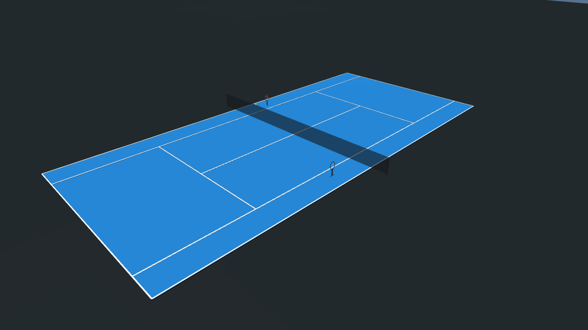](docs/images/rendered/mujoco/tennis.png) | [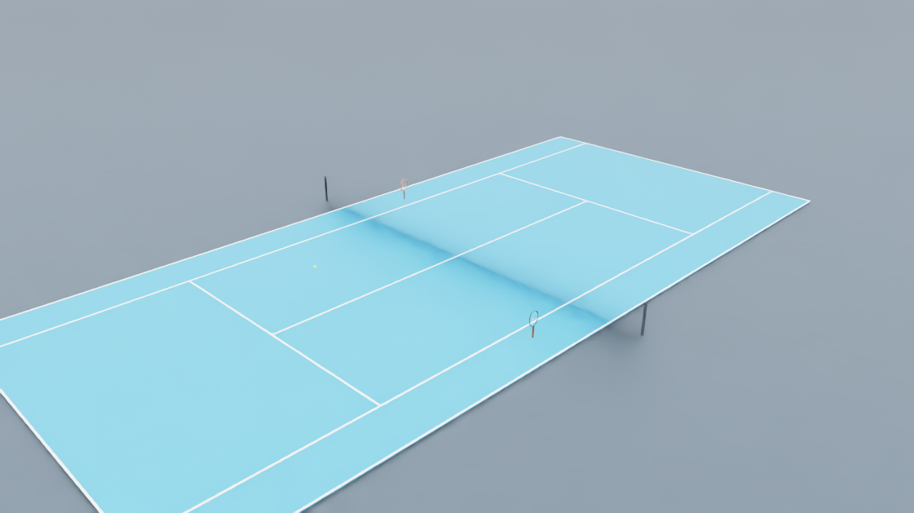](docs/images/rendered/isaac/tennis.png) |
| 乒乓球 | [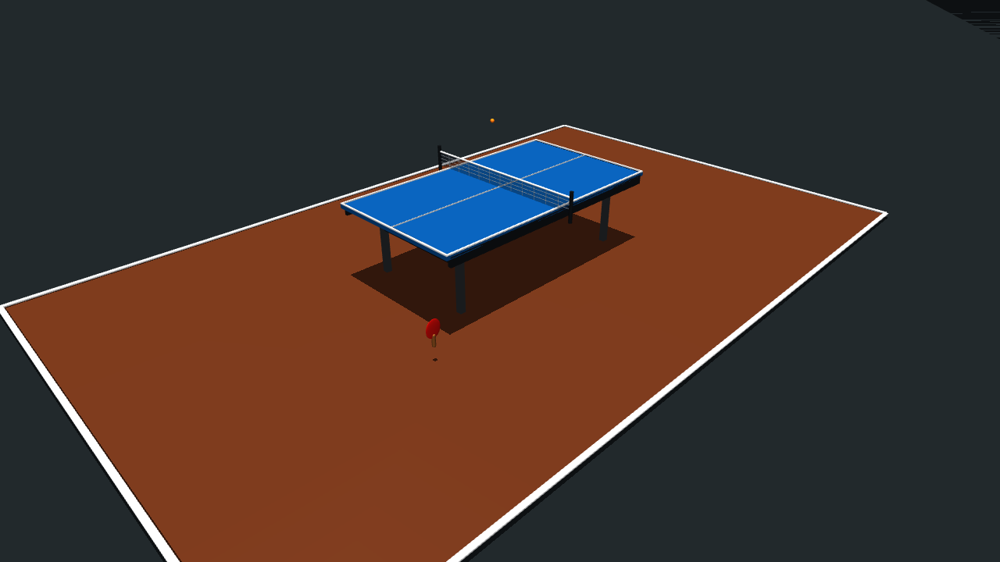](docs/images/rendered/mujoco/table_tennis.png) | [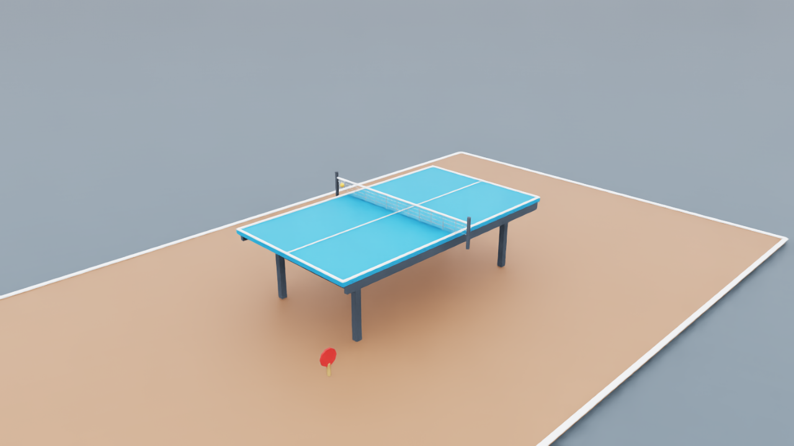](docs/images/rendered/isaac/table_tennis.png) |
| 足球 | [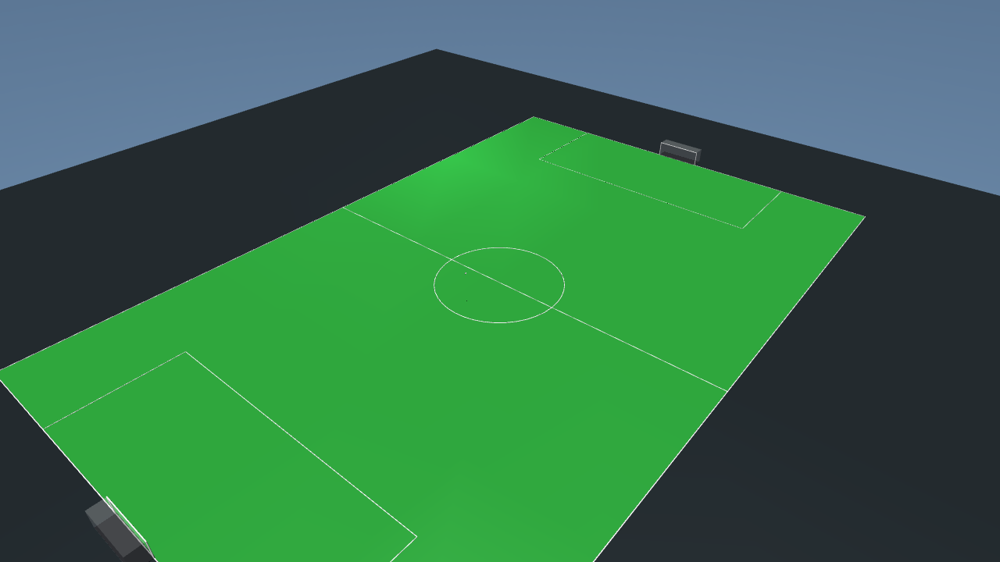](docs/images/rendered/mujoco/football.png) | [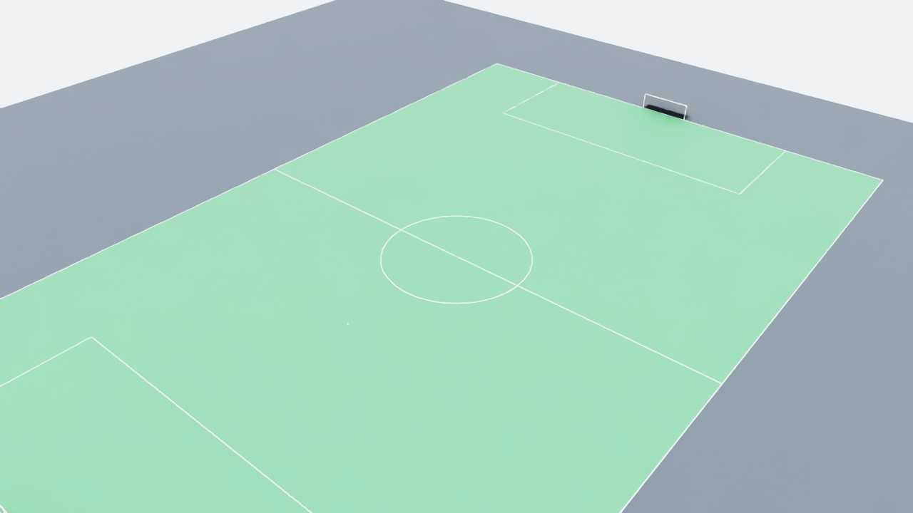](docs/images/rendered/isaac/football.png) |
| 羽毛球 | [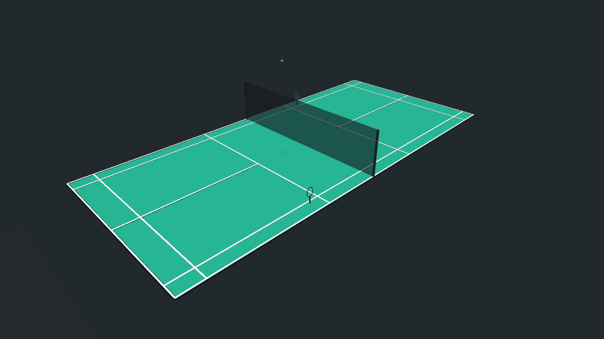](docs/images/rendered/mujoco/badminton.png) | [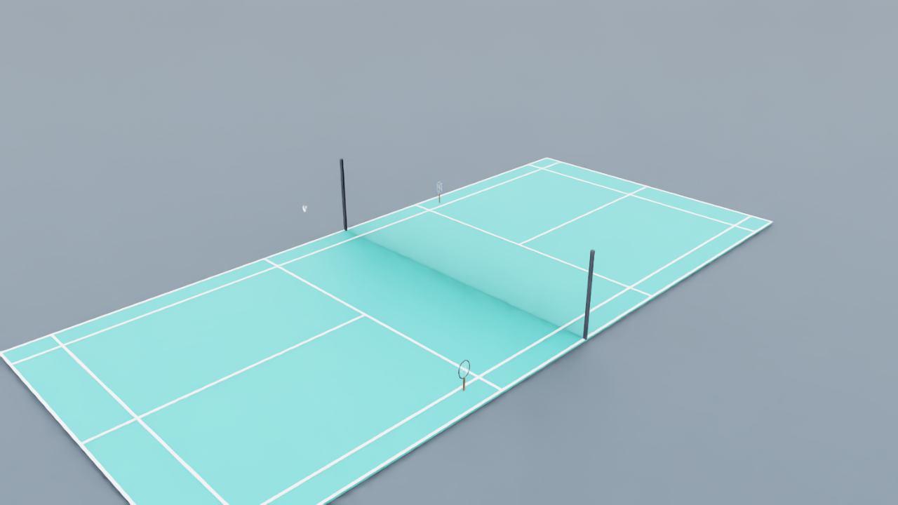](docs/images/rendered/isaac/badminton.png) |
| 篮球 | [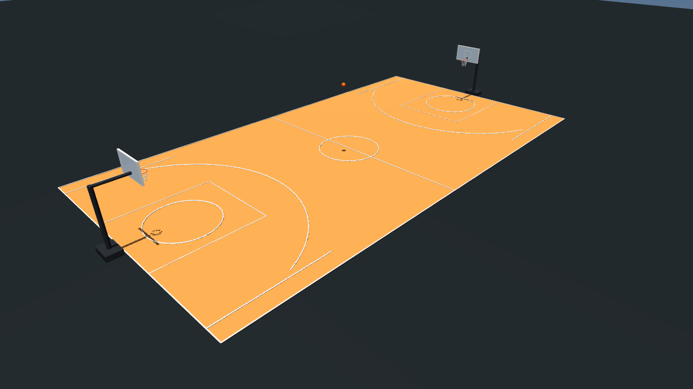](docs/images/rendered/mujoco/basketball.png) | [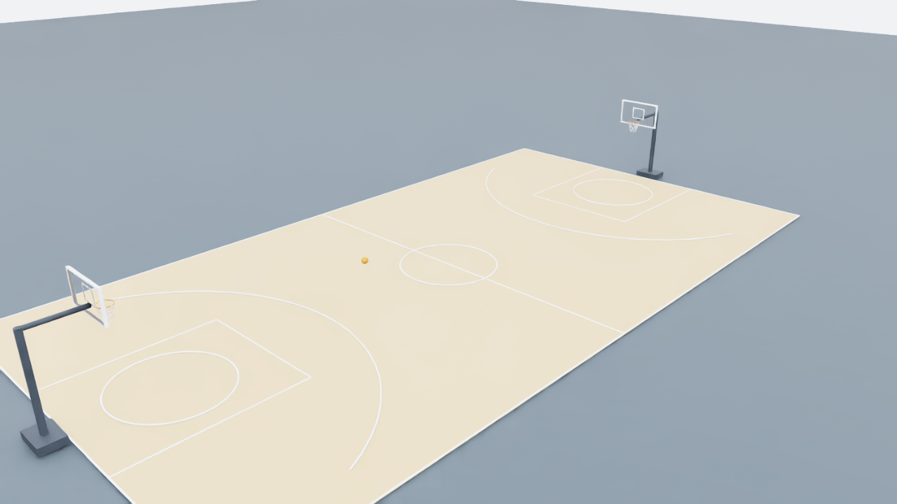](docs/images/rendered/isaac/basketball.png) |
| 壁球 | [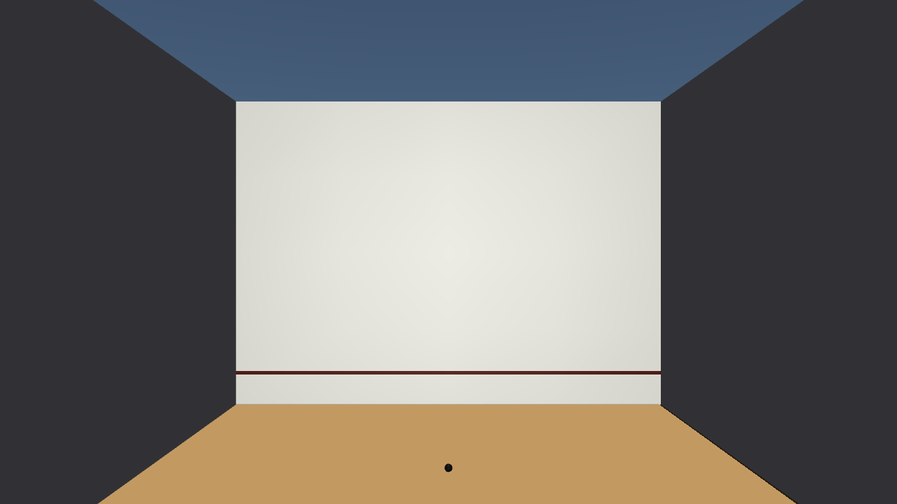](docs/images/rendered/mujoco/squash.png) | [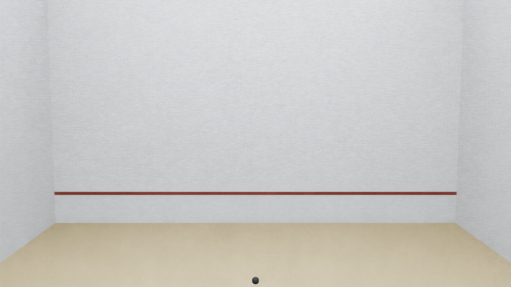](docs/images/rendered/isaac/squash.png) |

## MuJoCo 快速开始

需要 Python 3.10+。Linux 桌面运行原生 MuJoCo 查看器还需要可用的 OpenGL/GLFW。

```bash
python -m venv .venv
source .venv/bin/activate
uv sync --extra test   # 按 uv.lock 复现开发环境

# 全部场地总览
multisport-sim --scene campus

# 单项场景
multisport-sim --scene tennis
multisport-sim --scene table_tennis
multisport-sim --scene football
multisport-sim --scene badminton
multisport-sim --scene basketball
multisport-sim --scene squash
```

查看器中按 `Space` 再次发球，按 `R` 完整复位。鼠标操作沿用 MuJoCo 查看器：左键旋转、中键平移、滚轮缩放。

无显示器的服务器可以运行：

```bash
multisport-sim --scene campus --headless --duration 5
multisport-sim --scene badminton --headless --duration 3 --wind 2 0 0
multisport-sim --scene table_tennis --headless --duration 2 --no-launch
```

## Isaac Sim / PhysX 快速开始

Isaac 后端已在 Isaac Sim 5.0.0 + Isaac Lab 0.46.2 上验证。先进入已安装 Isaac Sim/Isaac Lab 的 Python 环境，再安装本仓库：

```bash
# 示例：使用当前工作区已有的 Isaac 环境
/path/to/isaac/python -m pip install -e . --no-deps

# GUI：加载全部场地，自动发球
multisport-isaac --scene campus

# 单项场景
multisport-isaac --scene badminton --wind 2 0 0
multisport-isaac --scene basketball
multisport-isaac --scene squash

# 完整得分演示：A 发球、B 回击、两次落地、B 得分（0:0 → 0:1）
multisport-isaac --scene squash --squash-demo --duration 9 \
  --demo-report reports/isaac/squash-demo.json

# 用同一条真实 PhysX 回合重建 JSON 报告和下方 GIF
make demo-squash ISAAC_PYTHON=/path/to/isaac/python

# 不启动 Isaac，独立复核已有 JSON 与 GIF 是否构成完整得分证据
make verify-squash-demo PYTHON=.venv/bin/python

# 无头运行和 USD 导出
multisport-isaac --headless --device cpu --scene campus --duration 2
multisport-isaac --headless --device cpu --scene tennis --duration 0.1 \
  --export-usd generated/tennis.usda

# PhysX 规则落球测试
multisport-isaac --headless --device cpu --scene table_tennis --drop-test
multisport-isaac --headless --device cpu --scene basketball --drop-test
```

演示中的前墙接触和两次落地由 PhysX 球路产生，脚本只施加发球与回击两次球拍冲量；JSON
报告会记录完整事件时间线，并且只有实际观察到第二次落地后才输出 `complete: true`。GIF
生成器还会核对固定事件顺序、最终 `0:1` 比分、帧数和逐帧变化，失败时拒绝覆盖演示资产。
`make demo-squash` 会把可提交的证据 JSON 与 GIF 一起写入 `docs/images/shot-skill/`。
独立校验器不依赖 Isaac 或 Pillow，可在普通 Python/CI 中复核事件时间线及 GIF 容器元数据。

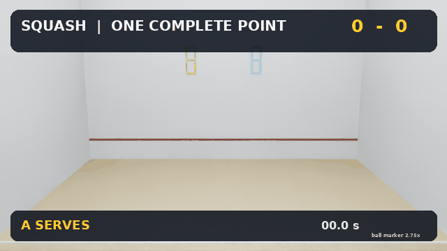

没有执行 editable install 时，也可直接运行：

```bash
PYTHONPATH=src /path/to/isaac/python \
  -m multisport_sim.isaac_cli --headless --device cpu --scene campus --duration 1
```

Isaac 后端使用 240 Hz PhysX TGS、CCD、每种球独立的 PhysX 材质、质量和恢复系数。空气阻力与 Magnus 力通过 Isaac Lab `RigidObject` 外力接口每个物理步施加；生成的 USD 可直接在 Isaac Sim 中再次打开。更多说明见 [docs/ISAAC_SIM.md](docs/ISAAC_SIM.md)。

## 后端对应关系

| 能力 | MuJoCo | Isaac Sim |
|---|:---:|:---:|
| 六个单项场景 + campus | ✓ | ✓ |
| 全部场地、器材和球 | ✓ | ✓ |
| 接触恢复、摩擦、滚阻 | MuJoCo soft contact | PhysX materials + TGS/CCD |
| 二次阻力、Magnus 力 | passive callback | RigidObject external wrench |
| 羽毛球方向阻力/稳定力矩 | ✓ | ✓ |
| 无头运行 | ✓ | ✓ |
| 可导出 USD | — | ✓ |

## Python API

```python
from multisport_sim import build_model
from multisport_sim.simulation import Simulation

model = build_model("campus")

simulation = Simulation("badminton", wind=(1.5, 0.0, 0.0))
simulation.launch()
for _ in range(1_000):
    simulation.step()
```

所有尺寸、质量、半径与气动系数集中在 `src/multisport_sim/specs.py`；MuJoCo 场地由 `scene.py` 生成，Isaac 场地由 `isaac_scene.py` 描述并由 `isaac_backend.py` 转成 USD/PhysX。详细公式、回弹校准和标准来源见 [docs/PHYSICS.md](docs/PHYSICS.md)。

## 验证

```bash
make test
make lint
make verify
make benchmark
make test-isaac ISAAC_PYTHON=/path/to/isaac/python
```

普通测试会编译全部 MuJoCo 场景、验证全部 Isaac 场景描述、核对球体质量/尺寸与器材名称、验证阻力方向和速度平方律，并实际仿真 MuJoCo 的 ITF/ITTF/FIBA 落球回弹。`test-isaac` 会真正启动 Isaac Sim、初始化全部六个 PhysX 球体并运行 campus。

## 乒乓球 Shot Skill

实验性的 `table-tennis-return-v0` 已实现固定 Shot Bank、MuJoCo 自动发球、真实球拍接触、合法回球/目标落点 Judge、分桶指标，以及 JSON/Markdown 报告。内置脚本 mocap 球拍只用于验证测试链路，不属于可提交的机器人策略。

```bash
# 完整链路基线
multisport-benchmark --level L1 --split dev --controller scripted \
  --report reports/table-tennis-l1.json --markdown reports/table-tennis-l1.md

# 无动作失败基线
multisport-benchmark --level L1 --split dev --controller noop
```

坐标约定、L0–L5 门槛、报告字段、固定集完整性和机器人 adapter 要求见 [乒乓球 Shot Skill 文档](docs/TABLE_TENNIS_SHOT_SKILL.md)。

### 机器人任务 `table-tennis-return-panda-v1`

与 `table-tennis-return-v0` **并列**的版本化任务：共享同一个 Judge、同一份固定 Shot Bank、同一组
reward 权重，唯一差别是击球的是一台有动力学的 7 DoF Franka Panda，而不是瞬移的 mocap 拍面。动作是
7 维关节位置设定值（rad，机械臂真实限位，未归一化），观测是 33 维状态，安全违规逐物理步检查、终止
episode 并计入分母，执行器机械功被积分为 `energy_joule`。

机械臂资产不随仓库分发，按 `MULTISPORT_MENAGERIE_PATH` → `MUJOCO_MENAGERIE_PATH` → `~/mujoco_menagerie`
顺序查找：

```bash
git clone --filter=blob:none --sparse https://github.com/google-deepmind/mujoco_menagerie ~/mujoco_menagerie
git -C ~/mujoco_menagerie sparse-checkout add franka_emika_panda
```

```bash
# 内置参考基线：hold / random / intercept，都不是可提交成绩
multisport-benchmark --robot panda --controller intercept --level L2 --split dev

# 三条基线 × 两个 split × L0–L5 的完整表
make baselines PYTHON=/path/to/python
```

**评测你自己训练好的策略**——策略是任意 `obs(33) -> action(7)` 的可调用对象，可以是
`module:policy`，也可以是返回策略的零参工厂：

```bash
python scripts/eval_policy.py --policy my_pkg.eval:load_policy --policy-id my-sac-v3 \
  --split test --levels all --out reports/my-sac-v3
```

每级输出一份完整 JSON/Markdown 报告，外加一张跨难度汇总表。观测向量的打包顺序由
`multisport_sim.benchmark.envs.panda_observation_vector` 唯一定义，Gymnasium 环境
`MultiSportRobot/TableTennisReturn-Panda-v1` 与离线打分路径读的是同一组数字。

### 视觉轨道（Vision track）

同一个任务的第二条观测轨道：**策略只能看见相机**。机器人、动作、Judge、Shot Bank、reward 和阈值
全部不变，唯一区别是观测对象上**没有 `ball` 字段**——这条规则由构造保证，不是靠文档约定。

声明的传感器套件：两台 320×240 / 120 Hz 立体相机（基线 4.2 m，分居球台两侧）+ 拍面 IMU、接触传感器、
关节力矩和 frame transform。相机位姿由 `CameraSpec` 决定并写进模型，所以报告里写的位姿就是渲染用的位姿。

```bash
# 内置视觉基线：和 intercept 完全相同的挥拍控制律，球的状态来自三角化而不是真值
multisport-benchmark --robot panda --track vision --level L1 --split dev

# 评测你自己的视觉策略
python scripts/eval_policy.py --policy my_pkg.eval:load_policy --policy-id my-vision \
  --track vision --split test --levels all --out reports/my-vision
```

策略拿到的 `obs` 是 `VisionObservation`：`obs.sensors.camera("ball_camera_left").rgb` 是
`(240, 320, 3)` 的 uint8 图像，`obs.robot.joint_positions` 是本体感知。训练用 Gymnasium 环境
`MultiSportRobot/TableTennisReturn-Panda-Vision-v1`（字典观测，含 `frame_age_s`——相机 120 Hz 而控制
200 Hz，中间那步拿到的是上一帧）。训练和评测读的是同一个打包函数。

参考感知管线（颜色分割 → 最大连通块 → 双射线三角化 → 最小二乘速度拟合）在 dev 全集 540 个立体帧上
实测：**位置误差中位数 0.81 cm、p90 1.02 cm、丢帧 8.1%**。用它跑出来的分数是：L1 命中率 100%（和
特权状态轨道打平），L2 命中率掉到 50%。**这个差值就是感知的代价，是测出来的而不是估计的。**

详见 [`docs/VISION_TRACK.md`](docs/VISION_TRACK.md)。

### 完整指标与结果包

报告现在覆盖 `BENCHMARK_SPEC` §7 的全部八项原始指标，新补的三项是 `contact_error`（拍面偏心距离 +
接触拍速）、`robustness_gap`（L1–L3 减 L4–L5）、`inference_latency_ms`（只对策略自己的 `act()` 计时）。

```bash
# 产出可复现的结果包：manifest / config / metrics / policy / videos / environment
make submission POLICY=my_pkg:load_policy POLICY_ID=my-sac-v3
```

manifest 会**如实记录工作区是否是脏的**，录像按 shot_id 排序取前 N 个成功**和**失败（不允许只挑成功），
权重按 sha256 内容哈希，没带权重的包会明说自己不完整。详见 [`docs/SUBMISSION.md`](docs/SUBMISSION.md)。

### 学习基线、后端一致性与可审计结果

- **学习基线**：`scripts/train_launch_policies.py` 用 PPO（Stable-Baselines3）在一个挥拍原语（面速、仰角、偏航修正）上
  学习，只看可观测几何量，不使用任何标定知识；五项任务各 5 个种子，train split 训练、test split 评测，
  与两个对照并列报告：未训练原语（参数全取中值）与随机原语。学习在乒乓球、篮球与羽毛球定点上明显有效，网球只与先验持平，足球定点反而变差——见 [`docs/LEARNED_BASELINES.md`](docs/LEARNED_BASELINES.md)。权重、训练曲线、墙钟时间与硬件都在 `baselines/learned/`，结果见 `reports/learned-*-baselines.md`。
- **Isaac Lab 实跑与一致性**：乒乓球 Isaac Lab 环境在 CPU PhysX 上实跑，与 MuJoCo 同批球逐条对比（`make parity`）：
  飞行段中位差 3.5 mm、判定一致 99%，反弹后高度差约 5 cm（M4 待标定）。见 [一致性报告](reports/table-tennis-backend-parity.md)。
- **可审计结果**：`scripts/audit_submission.py` 从结果包的原始回合重算全部判定与指标、核对每级 shot 集完整、
  固定集 digest 与权重哈希，并可重跑复核。所有发布的文件格式都有带版本号的 JSON Schema（`multisport_sim.benchmark.schemas`）。

### 羽毛球发球任务 `badminton-serve-v0`

第三项运动，也是第一个**发射类**任务：羽毛球在机器人一侧放手，等待被击出；按 BWF 规则判
1.15 m 击球高度、对角单打发球区和擦网好球。动作/观测/报告与回球任务完全相同。

```bash
multisport-benchmark --sport badminton --level L2 --split test --controller scripted
python scripts/run_fixture_baselines.py --sport badminton
```

为让 5 g 的羽毛球在 20–30 m/s 的击球下物理可信，羽毛球 benchmark 场景使用 0.5 ms 物理步长、
按物理步插值的 mocap 拍面，以及在压心处计算来流的气动力。详见 [`docs/BADMINTON.md`](docs/BADMINTON.md)。

### 足球射门与篮球投篮

第四、五项运动 `football-kick-v0`、`basketball-shoot-v0`，与羽毛球发球共用发射类任务框架：任务坐标原点
放在球门线/篮圈正下方，机器人在 x<0 一侧出手；按 IFAB（整球越线）和 FIBA（从上方穿过篮圈）判定。

```bash
multisport-benchmark --sport football --level L3 --split test --controller scripted
multisport-benchmark --sport basketball --level L2 --split test --controller scripted
make cross-task   # 全部任务 × 全部级别的汇总表
```

详见 [`docs/LAUNCH_TASKS.md`](docs/LAUNCH_TASKS.md) 与 [`reports/cross-task-summary.md`](reports/cross-task-summary.md)。

### 网球任务与统计充分的固定集

第二项运动 `tennis-return-v0` 已可运行：**同一个 Judge、同一套 L0–L5 门槛、同一份报告 schema**，
只换几何与量纲（23.77 × 8.23 m 单打场地、地面即落点、3 s episode、17–34 m/s 来球）。

```bash
multisport-benchmark --sport tennis --level L2 --split test --controller scripted
make tennis-baselines PYTHON=/path/to/python
```

固定集也够大了。`scripts/generate_shot_bank.py` 生成的 `table_tennis/return-v1` 与 `tennis/return-v0`
每个都是 **train 1200 / dev 300 / test 600（每级 100 条）**，三个 split 的种子和球本身都不重叠。
每条球都在真实场景里发射验证过，`short`/`deep`/`edge` 标签来自**实测落点**，L4/L5 的每个
pass_bucket 都由分层采样保证非空。

```bash
# Panda 默认使用统计充分的 v1 固定集
multisport-benchmark --robot panda --level L2 --split test
```

`return-v1` 的 L5 还声明了真实扰动——观测噪声、观测/动作延迟、域随机化——全部由 manifest 决定、
由 episode 种子决定、可精确重放，且**只扰动策略看到的东西，不扰动 Judge 看到的东西**。
**`return-v0` 一个字节都没改**，在它上面产生过的分数全部仍然有效。

详见 [`docs/TENNIS.md`](docs/TENNIS.md) 与 [`docs/SHOT_BANKS.md`](docs/SHOT_BANKS.md)。

参考基线成绩见 [`reports/table-tennis-panda-baselines.md`](reports/table-tennis-panda-baselines.md)，
机体标定、可达性结论与安全包络见 [`docs/ROBOT_LAYER.md`](docs/ROBOT_LAYER.md)。Panda 基线表使用
`table_tennis/return-v1`：dev 每级 50 条、test 每级 100 条；L4/L5 还逐 bucket 报样本量和 Wilson 区间。
bucket 最少仍只有 14 条，因此最弱 bucket 的点估计不能脱离区间作为发表结论。

## 真实度量化评测

仓库提供统一的 `multisport-fidelity-v1` 报告格式。它不是只检查参数，而是实际执行落球仿真，测量第一次回弹最高点，并输出绝对误差、相对误差、容差占用率、等效恢复系数、PASS/FAIL、单项分数和总分。ITF、ITTF、FIBA 指标与项目工程指标分别统计，避免混淆官方标准和经验校准范围。

```bash
# MuJoCo：一次评测六种球，生成 JSON 和 Markdown
make evaluate PYTHON=/path/to/python

# Isaac Sim：每种球在独立 Kit 进程中评测，再聚合为同格式报告
make evaluate-isaac ISAAC_PYTHON=/path/to/isaac/python PYTHON=/path/to/python

# 也可只评测指定项目
multisport-eval --sports tennis table_tennis basketball
multisport-isaac --headless --device cpu --scene basketball \
  --evaluate --report reports/isaac/basketball.json
```

当前提交附带的基线报告：MuJoCo 为 [`reports/mujoco-fidelity.md`](reports/mujoco-fidelity.md)，Isaac Sim 为 [`reports/isaac-fidelity.md`](reports/isaac-fidelity.md)。评分公式、参考区间和解释见 [`docs/PHYSICS.md`](docs/PHYSICS.md)。高分表示这些已测指标接近参考值，不代表尚未测量的球拍碰撞、柔性网或完整比赛行为已经得到验证。

## 设计边界

这是刚体动力学和接触/气动力仿真，不是有限元球体变形模型。普通展示场景中的球拍固定在场边；`table-tennis-return-v0` 加载的独立 mocap 拍面只是测试夹具，不具备关节、执行器、动力学或安全约束——需要这些的评测请用 `table-tennis-return-panda-v1`。机器人层已包含 Panda、固定骨盆 G1 和自由站立 G1；自由站立版本使用踝关节反馈维持平衡，尚无步法。传感器层支持 RGB 与 RGB-D 视觉输入。基础相机渲染无传感器噪声，但 `return-v1` 的 L5 会按 manifest 施加观测噪声、观测/动作延迟和有限域随机化。项目仍没有人体运动员或完整比赛规则。

拟议的首批机器人任务、state/vision/robustness 轨道、指标、结果包和发布门槛见 [benchmark 协议](docs/BENCHMARK_SPEC.md)。实验性 Shot Skill 可用于开发和回归测试，但在这些门槛满足前不能作为完整机器人 benchmark 或排行榜发布。

## 开源协作与引用

提交代码前请阅读 [CONTRIBUTING.md](CONTRIBUTING.md)。资产、数据和权重必须具有可再分发的许可证与明确来源。研究使用可引用 [CITATION.cff](CITATION.cff)；获得归档 DOI 后会更新正式引用信息。

## License

MIT，见 [LICENSE](LICENSE)。
