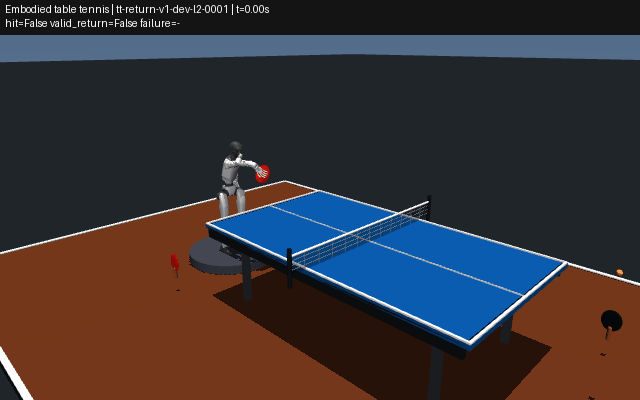

# 人形机器人视觉打乒乓球

本仓库现在提供可运行的 **MuJoCo Unitree G1 视觉回球方案**：保留骨盆自由关节，
四个踝关节用理想骨盆 IMU 反馈维持站立，腰部与右臂的十个关节执行视觉挥拍控制。
球的位置、速度由图像估计；球拍接触、飞行和落点由物理仿真与原有 Judge 判定。

这是一套仿真站立回球基线：没有步法、连续对打策略或实机驱动；每个来球回合之间会复位。
站立平台高 0.1 m、直径 1 m；脚底靠物理接触支撑，骨盆没有固定约束，也没有机身外力扶持。
`g1` 的原有固定骨盆任务保留；新自由基座任务是 `g1-standing` / `table-tennis-return-g1-standing-v2`。

## 启动

在仓库根目录运行。当前工作区的 `.venv` 和 G1 资产已实测可用。

```bash
# 窗口：单台 RGB-D 相机驱动自由站立 G1
MUJOCO_GL=glfw .venv/bin/python -m multisport_sim.benchmark_cli \
  --config configs/humanoid-rgbd.json --viewer

# 窗口：双目 RGB
MUJOCO_GL=glfw .venv/bin/python -m multisport_sim.benchmark_cli \
  --config configs/humanoid-stereo.json --viewer

# 无显示器：计算完整开发集的 50 个 L2 回合
MUJOCO_GL=egl .venv/bin/python -m multisport_sim.benchmark_cli \
  --config configs/humanoid-rgbd.json --episodes 50 \
  --report reports/humanoid-rgbd-dev-l2.json

# 对实际打分回合录像；包括成功和失败，按固定集原顺序
MUJOCO_GL=egl .venv/bin/python -m multisport_sim.benchmark_cli \
  --config configs/humanoid-rgbd.json \
  --video generated/humanoid.gif --report generated/humanoid.json
```

关闭窗口会中断运行，返回错误并且不写完整成绩报告。默认配置运行前五个 L2 开发回合，
终端显示命中率、合法回球率和安全违规率；结果路径在配置的 `report` 字段中。
`--viewer` 只负责显示，`--video` 记录同一次物理回合；控制器不读取展示相机。

新机器的安装：

```bash
python3 -m venv .venv
.venv/bin/python -m pip install -e '.[test,submission]'
git clone --depth 1 --filter=blob:none --sparse \
  https://github.com/google-deepmind/mujoco_menagerie ~/mujoco_menagerie
git -C ~/mujoco_menagerie sparse-checkout add unitree_g1
```

已有 Menagerie checkout 时只需补入 `unitree_g1`；也可设置 `MULTISPORT_MENAGERIE_PATH`。
模型沿用上游 BSD-3-Clause 许可证，加载时添加球拍与平台，不复制或修改上游文件。
录像需要可选的 Pillow；纯仿真与窗口不需要 Pillow。

## 配置视觉输入

只提供深度图、不使用 RGB 内容时，直接运行：

```bash
MUJOCO_GL=glfw .venv/bin/python -m multisport_sim.benchmark_cli \
  --config configs/humanoid-depth.json --viewer
```


[RGB-D 配置](../configs/humanoid-rgbd.json) 与 [双目配置](../configs/humanoid-stereo.json)
是严格 JSON。字段对应 CLI 参数，使用下划线，例如 `swing_lead_s`；命令行参数覆盖配置。
未知字段或非法枚举值会直接报错。

| 配置 | 策略输入 |
|---|---|
| `track: "vision", perception: "depth"` | 只读取米制光轴深度；用发球前的深度背景和小球几何筛选前景，RGB 内容对策略屏蔽 |
| `track: "vision", perception: "rgbd"` | 一台相机的 RGB + 对齐的米制光轴深度；RGB 分割球，深度恢复三维位置 |
| `track: "vision", perception: "stereo"` | 两台 RGB 相机；颜色分割后用标定外参三角化 |
| `track: "state"` | 显式开启球真值，仅作控制诊断；不属于视觉成绩 |

RGB-D 与双目参考检测器针对仿真中的橙色乒乓球。`depth` 模式不读取 RGB，
但要求固定标定相机、发球前的背景深度帧，以及球台来球区域内的小球几何假设。
它不是任意场景的通用深度目标识别器；移动相机时需要更换感知实现。
纯深度模式下 Gym 观测不包含 RGB 键，CLI 策略收到的 RGB 数组全零。
相机默认是固定在球台旁的仿真相机，不是实机 USB 摄像头；此版本不包含实机控制或相机驱动。

相机分辨率、帧率、视场、位置和旋转可用独立配置改变：

```bash
MUJOCO_GL=egl .venv/bin/python -m multisport_sim.benchmark_cli \
  --config configs/humanoid-rgbd.json \
  --sensor-config configs/cameras-rgbd.json
```

参见 [RGB-D 相机](../configs/cameras-rgbd.json) 和 [双目相机](../configs/cameras-stereo.json)。
`position` 使用场地坐标，单位米；`quaternion` 是相机到世界的 `wxyz` 旋转，
相机朝本地 −Z、+Y 向上；`depth: true` 输出光轴距离，单位米，不是欧氏射线距离。
参考跟踪器只支持 `mount: "world"`。修改传感器配置会改变实际模型和报告里的相机声明。

若在自己的相机驱动中提供图像，公共接口是
`CameraFrame(name, time_s, rgb, depth)` → `SensorReadings` → `RGBDBallTracker` / `StereoBallTracker`。
`rgb` 是 H×W×3 `uint8` RGB，`depth` 是对齐的 H×W `float32` 米制光轴深度。
`DepthBallTracker(camera, background)` 接受同样的帧容器，RGB 可以全零；它只读取深度。
需要自行提供与真实标定一致的 CameraSpec、同步时间戳与机器人接口；本 CLI 的图像源仍是仿真。

## 策略接口与训练环境

```python
import gymnasium as gym
import multisport_sim.benchmark  # 注册环境

env = gym.make(
    "MultiSportRobot/TableTennisReturn-G1-Standing-Vision-v2",
    perception="rgbd",  # 或 stereo / depth
)
obs, info = env.reset(seed=0)
print(obs["ball_camera_left"].shape)        # (240, 320, 3)
print(obs["ball_camera_left_depth"].shape)  # (240, 320)
print(obs["base_imu"].shape)                # (10,): wxyz, gyro xyz, acceleration xyz
print(env.action_space.shape)              # (10,): 腰部3 + 右臂7，关节位置rad
# action = your_policy(obs)
# obs, reward, terminated, truncated, info = env.step(action)
env.close()
```

观测还包含 `joint_positions`、`joint_velocities`、`blade_pose`、`frame_age_s`。
视觉观测没有 `ball` 字段。四个踝关节由独立平衡反馈控制，其余关节保持站姿。
相机与控制器帧率不一致时保留时间戳，跟踪器不把重复帧当成新测量。

CLI 也可以通过 `--policy your_module:factory` 加载自己的策略。工厂返回可调用对象，
或者提供 `act(observation)` 的对象；可选 `reset(seed=...)` 每回合调用一次。
视觉策略接收 `VisionObservation`，用 `observation.sensors.camera(name)` 访问图像，
返回十个有限的关节位置设定值。错误维度和越界命令会被拒绝。
这与 Gym 的字典接口不同，可调用 `vision_observation_dict(observation, sensors=...)` 转换。
自定义策略不能同时使用内置挥拍参数；直接运行如下命令，或从 JSON 中移除
`rate_margin`、`blade_tilt_deg`、`swing_lead_s`：

```bash
MUJOCO_GL=egl .venv/bin/python -m multisport_sim.benchmark_cli \
  --robot g1-standing --track vision --perception rgbd \
  --policy your_module:factory --level L2 --episodes 5
```

## 验证与限制

内置挥拍参数在训练集前 20 个 L2 回合选择：`rate_margin=0.2`、`blade_tilt_deg=15`、
`swing_lead_s=0.08`。站立反馈为 `kp=0.5`、`kd=0.1`，在同一训练集上选择。
独立开发集报告包含全部 50 个 L2 回合，不筛选成功样本。报告还记录自由基座状态、
最大倾角、最低骨盆高度、相机参数和 29 个执行器的机械功。

骨盆高度低于 0.65 m 或倾角超过 0.6 rad 时记为安全失败；其余 19 个关节也检查位置、
速度、力矩，不能只检查挥拍的十个关节。报告的 `robot_metrics.safety_details`
与回合顺序对齐，保留 `kind`、实际测量值、阈值与关节名称；`balance` 表示机身失衡，
`joint_velocity` 等表示关节违规。速度包络沿用明确标记的 10 rad/s 占位值，
不是 G1 官方额定速度。这些测试验证仿真运行能力，不构成实机安全认证。

自由基座的实测结果（L2 / dev 全集，各 50 回合）：

| 输入 | 命中 | 合法回球 | 安全失败 |
|---|---:|---:|---:|
| 纯深度 | 34/50（68%） | 18/50（36%） | 6/50（12%） |
| RGB-D | 34/50（68%） | 17/50（34%） | 3/50（6%） |
| 双目 RGB | 30/50（60%） | 8/50（16%） | 2/50（4%） |

[纯深度完整报告](../reports/humanoid-depth-dev-l2.json) ·
[RGB-D 完整报告](../reports/humanoid-rgbd-dev-l2.json) ·
[双目完整报告](../reports/humanoid-stereo-dev-l2.json) ·
[演示回合报告](../reports/humanoid-rgbd-demo.json)

默认建议使用 RGB-D；纯深度虽然多一次回球，但安全失败更多。
仍有倾角、碰撞或工作空间违规引起的失败，所以这不是稳定完成所有来球的策略。
截图和下面的 GIF 取前五个开发回合，其中两次合法回球，无安全违规；不筛选成功球。



原有固定骨盆对照可用 `configs/g1-rgbd.json` / `configs/g1-stereo.json` 启动。
固定骨盆开发集 L2 结果分别为：RGB-D 37/50 命中、15/50 合法回球；双目 29/50 命中、
12/50 合法回球，均无安全违规。它们不与自由站立版本混算。

## SMASH / LATENT

2026-09-08 核查官方来源：

- [SMASH 官方项目页](https://mmlab.hk/Smash/) 展示视觉与全身乒乓球系统，但页面没有代码或权重入口。
- [LATENT 官方仓库](https://github.com/GalaxyGeneralRobotics/LATENT) 已公开动作跟踪训练，
  高层网球策略、预训练 latent action model 等仍在待发布列表。

因此本次运行的是本仓库的 G1 视觉控制器，**没有冒用 SMASH / LATENT 的名称或成绩**。
以后接入上游策略时，必须匹配其机器人、关节顺序、观测、历史长度、动作尺度与控制频率；
高层 latent 动作不能直接当作本环境的十维关节命令。没有权重时不能靠一个加载接口复现论文系统。
