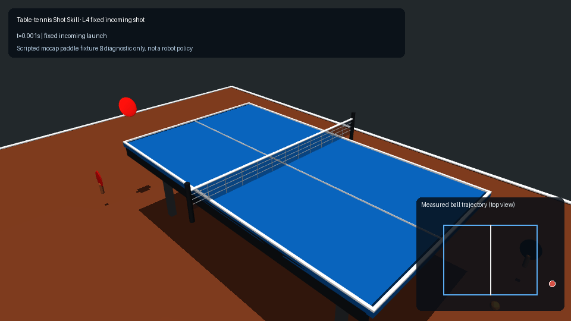

# 乒乓球 Shot Skill 测试系统

`table-tennis-return-v0` 是 [Benchmark 设计稿](Benchmark.md) 的第一项可执行实现。它用固定单球分布分别测量机器人或控制器能否碰到来球、完成合法回球，以及把首次合法落点送入目标区。

> **状态：experimental v0 / non-leaderboard。** 当前仓库提供 MuJoCo 参考后端、版本化开发/测试 Shot Bank 和一个 mocap 脚本球拍夹具，用于验证发球、接触事件、规则 Judge 与报告链路。脚本夹具不是机器人提交；v1 固定集、Isaac Sim adapter、Gymnasium 环境和可提交的机器人 adapter 仍需后续发布。

## 测试链路

```text
固定 Shot Bank
      ↓
Controller / Robot Adapter
      ↓
MuJoCo 自动发球与逐物理步仿真
      ↓
语义接触 + 接触上升沿去重
      ↓
TableTennisReturnJudge
      ↓
逐球结果 → 汇总指标 / 分桶 / JSON / Markdown
```

规则 Judge 不读取 MuJoCo geom 名称，也不使用球拍距离阈值。后端只向它提供 `ball`、`robot_racket`、`table`、`net`、`floor` 等语义接触，因此后续后端可复用完全相同的判定逻辑。

## L4 可视化回放

下方动画回放开发集固定来球 `tt-return-v0-dev-l4-0001`：橙色小球由对手侧发出，先在机器人侧台面落球，再由红色 mocap 测试拍真实击中、越过球网并落到对手侧。右下角轨迹窗直接由每个 MuJoCo 物理步的球状态绘制；蓝色点为台面落球，绿色点为拍面接触。



该回放的规则结果为 `incoming_valid=true`、`hit=true`、`valid_return=true`：机器人侧台面接触发生在 0.378 s，拍面接触发生在 0.550 s，合法回球在 1.202 s 完成。红色拍面是内置的脚本 mocap 测试夹具，不是机器人策略，也不应作为 benchmark 成绩使用。

可回放同一条底层固定测试（单条样本不包含 L4 的全部必测桶，因此不应附加 `--require-pass`）：

```bash
multisport-benchmark --level L4 --split dev --episodes 1 --controller scripted
```

要验证完整 L4 的分桶门槛，请运行开发集的两条固定样本：

```bash
multisport-benchmark --level L4 --split dev --controller scripted --require-pass
```

## 坐标与合法回球

设计稿中的伪代码采用球台长度沿 `y` 的示意坐标；当前项目场景的真实坐标如下，v0 Shot Bank 和报告均以此为准：

- 球台中心为原点，`+x` 从机器人侧指向对手侧，`+y` 为横向，`+z` 向上。
- 机器人半台为 `-1.37 <= x < 0`，对手半台为 `0 < x <= 1.37`。
- 球台宽度边界为 `abs(y) <= 0.7625`，台面高 `0.76 m`。
- 网面位于 `x = 0`，网顶高 `0.9125 m`。

一次合法回球必须依次发生：

1. 球与机器人拍面产生真实物理接触；
2. 击球后球从 `x < 0` 正向越过网面；
3. 击球后的首次球台接触位于对手半台有效边界内。

来球在击球前落到机器人半台属于正常入球，不会被误判为 `own_side`。擦网不立即失败；擦网后仍首次落到对手台的球继续判为合法回球。

## 运行

安装测试依赖后，可直接运行内置固定集：

```bash
# 脚本 mocap 球拍：验证完整 Shot Skill 链路
multisport-benchmark --level L1 --split dev --controller scripted \
  --report reports/table-tennis-l1.json \
  --markdown reports/table-tennis-l1.md

# 无动作基线：用于确认 miss/timeout 等失败路径
multisport-benchmark --level L1 --split dev --controller noop

# 默认按文件顺序运行该 level 的全部 shot；也可只做快速冒烟测试
multisport-benchmark --level L2 --split test --episodes 3 --seed 7
```

未做 editable install 时：

```bash
PYTHONPATH=src python -m multisport_sim.benchmark_cli --level L1 --split dev
```

正常完成一次评测时，控制器得分为零也会返回退出码 `0`；低分是结果，不是程序错误。只有传入 `--require-pass` 时，等级未通过才返回非零退出码。

同一 Runner 也可从 Python 调用：

```python
from multisport_sim.benchmark import RunConfig, ShotBank, run_shots
from multisport_sim.benchmark.backends.mujoco import MujocoShotBackend
from multisport_sim.benchmark.controllers import ScriptedPaddleController

bank = ShotBank.from_resource(split="dev").filter(level="L2")
output = run_shots(
    MujocoShotBackend(),
    ScriptedPaddleController(),
    bank,
    config=RunConfig(seed=7, control_hz=200.0),
)
for result in output.results:
    print(result.to_dict())
```

## 等级与 v0 门槛

| Level | 主要变化 | v0 通过条件 |
|---|---|---|
| L0 Physics | 无需击球，检查固定来球是否合法 | incoming-valid rate = 100% |
| L1 Intercept | 中路、低速、低旋 | hit rate >= 90% |
| L2 Return | 横向位置和速度变化 | valid return rate >= 80% |
| L3 Placement | 左/中/右圆形目标 | target rate >= 70% |
| L4 Robustness | 快球、旋转、边线、低球组合 | manifest 指定的必测桶均 >= 60% |
| L5 Generalization | held-out 组合 | overall >= 60%，最弱 held-out 桶 >= 50% |

这些是正式 benchmark 的候选规则在 experimental v0 中的明确解释。数据集仍是小型工程验证集，不满足设计稿建议的正式 dev/test 样本量，因此不能用于跨论文或排行榜比较。

## Shot Bank

内置资源位于：

```text
src/multisport_sim/benchmark/data/table_tennis/return-v0/
├── manifest.json
├── dev.jsonl
└── test.jsonl
```

每条 `ShotSpec` 固化初始位置、线速度、角速度、level、tags，以及 L3+ 可选目标中心和半径。加载器拒绝重复 ID、非有限浮点、错误维度、未知 level、sport/task 不匹配和 manifest 哈希不一致。正式执行保持 JSONL 文件顺序，每颗球恰好运行一次；`seed` 仅用于 controller 内部随机性，不会偷偷重采样固定测试集。

## 报告语义

JSON 是完整事实源，包含：

- task/schema/status、后端与 MuJoCo 版本、Python/项目版本、physics/control timestep；
- robot/adapter 与 controller 标识、seed、split、manifest/JSONL SHA-256 和实际执行的 shot IDs；
- 每颗球的 `hit`、`valid_return`、`target_hit`、首次落点、接触时间、入/出球速度和失败原因；
- aggregate hit/return/target/safety rate、目标误差样本数、95% Wilson 区间；
- 每个 tag 的分桶结果和 `miss/net/own_side/out/floor/timeout/safety/numerical` 失败计数；
- 当前 level 的门槛判定与未通过原因。

所有 rate 都以本次运行的全部 episode 为分母。平均目标误差只在“定义了目标且产生合法对手台落点”的样本上计算，并同时报告样本数，避免不同分母造成歧义。

## 接入机器人控制器

Runner 只依赖后端与 controller 协议，不依赖脚本球拍实现。一个新的机器人 adapter 需要完成：

1. `reset` 后恢复同一确定性初态；
2. 把 `ShotSpec` 转为后端球体的自由关节状态；
3. 输出球状态和统一语义接触；
4. 把 controller action 应用到机器人关节或执行器；
5. 每个物理步都保留接触检测，避免高速碰撞在 control decimation 中漏检。

正式机器人不得使用 mocap 球拍夹具，也不得以球拍与球的距离代替接触。Rules 和训练 reward 必须继续分离：可以为 RL 设计 dense reward，但 benchmark 成功只由这里的事件序列决定。

## 已知边界

- v0 只实现 MuJoCo Shot Skill 参考后端；Isaac Sim 将通过相同语义接口接入。
- 当前脚本球拍是测试夹具，不包含机器人动力学、执行器限制、感知噪声或安全包络。
- 内置固定集规模只适合持续集成和接口开发，不提供统计充分的排行榜结论。
- 当前球台是刚体 box，边缘/侧面判定会结合接触点和台面法向；尚未模拟球台柔性与球拍胶皮的精细材料模型。
